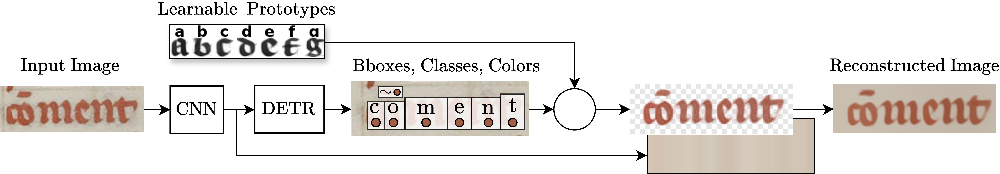
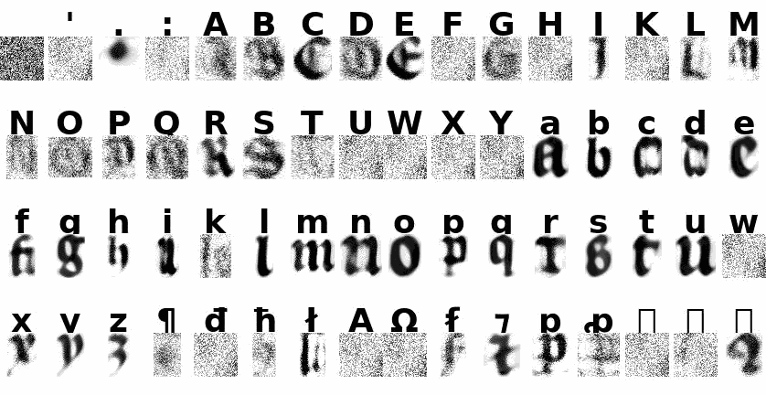

<div align="center">

<h1><a href="https://malamatenia.github.io/morphology4metrology-analysis/">Leveraging Morphology for Historical Script Metrological Analysis</a><br>(ICDAR 2026)</h1>

<font size="4">
<a href="https://malamatenia.github.io/">Malamatenia Vlachou Efstathiou</a>*&emsp;
<a href="https://raphael-baena.github.io/">Raphaël Baena</a>*&emsp;
<a href="https://www.irht.cnrs.fr/fr/annuaire/stutzmann-dominique/">Dominique Stutzmann</a>&emsp;
<a href="https://imagine.enpc.fr/~aubrym/">Mathieu Aubry</a>
</font>

<br><br>

&nbsp;

</div>

## Description
This repository contains the official implementation of the architecture presented in **Leveraging Morphology for Historical Script Metrological Analysis** (ICDAR 2026).

Our codebase extends the detection-based text recognition model (DTLR) with a prototype-based line reconstruction module. It provides the complete pipeline to train the model and extract interpretable, learnable character **prototypes** along with precise, instance-level **bounding boxes** using only line-level transcription supervision.

> **Note:** This repository handles the deep learning architecture, training, and output generation. To perform the downstream metrological and paleographical analysis (and reproduce the visualizations reported in the paper), please export the outputs from this pipeline and use our dedicated analysis toolkit: **[dtlr-for-metrology](https://github.com/malamatenia/morphology4metrology-analysis)**.

## Content

<details>
<summary>Paper Dataset</summary>

## Paper dataset (BnF fr. 2813)

Experiments in the ICDAR 2026 paper use the **Grandes Chroniques de France** line dataset ([Paris, BnF, fr. 2813](https://gallica.bnf.fr/ark:/12148/btv1b84472995)), published on Zenodo:

**[Dataset for BnF, fr. 2813 — Grandes Chroniques de France](https://zenodo.org/records/18745702)** (DOI: [10.5281/zenodo.18745702](https://doi.org/10.5281/zenodo.18745702))

Download `dataset.zip`, extract under your `datasets_path`, and use `--data_folder btv1b84472995` (folder name matches the Gallica ark id).

Ready-made training scripts for this dataset:

| Script | Step |
|--------|------|
| [`scripts/btv1b84472995/line_step_0.sh`](scripts/btv1b84472995/line_step_0.sh) | Pretraining (frozen boxes) |
| [`scripts/btv1b84472995/line_step_1.sh`](scripts/btv1b84472995/line_step_1.sh) | Full training |
| [`scripts/btv1b84472995/line_step_2.sh`](scripts/btv1b84472995/line_step_2.sh) | Per-document finetuning |

Adjust paths (`model_checkpoint_path`, `datasets_path`, GPU id) before running.

</details>

<details>
<summary>Installation</summary>

## Installation

Follow the base setup from the upstream [DTLR repository](https://github.com/raphael-baena/DTLR) (Python/PyTorch, `requirements.txt`, deformable-attention CUDA ops). Summary:

1. Clone this repo and create a Python environment.
2. Install a [PyTorch](https://pytorch.org/get-started/locally/) build matching your CUDA version (upstream targets `python=3.11`, `pytorch=2.1`, `cuda=11.8`).
3. `pip install -r requirements.txt`
4. Compile DINO ops (from the repo root):
   ```bash
   cd models/dino/ops && python setup.py build install
   python models/dino/ops/test.py   # optional sanity check
   ```
   If CUDA is not found: `export CUDA_HOME=/usr/local/cuda-<version>` (see upstream README).

Then configure this project:

Set the datasets root in [`datasets/config.json`](datasets/config.json):

```json
{
  "datasets_path": "/path/to/your/datasets"
}
```

</details>

<details>
<summary>Input Data Format</summary>

## 1. Input data (line dataset format)

Training and inference expect a dataset folder under `datasets_path` (loaded via `--dataset_file dataset`, see [`datasets/dataset.py`](datasets/dataset.py)):

```
<datasets_path>/<data_folder>/
├── annotation.json          # required
├── images/
│   ├── <document_prefix>/   # one folder per manuscript / subset
│   │   ├── <line_id>.png
│   │   └── ...
│   └── ...
```

### `annotation.json`

JSON object keyed by **line image filename** (must match files under `images/`):

```json
{
  "IB15304245v_eSc_line_65f6c260.png": {
    "label": "sy enlas armas por bueno q̃ sea",
    "page": "IB15304245v.jpg",
    "split": "train",
    "script": "Southern_Textualis"
  }
}
```

| Field | Description |
|-------|-------------|
| `label` | Transcription (Unicode; combining marks for accents) |
| `page` | Source page id |
| `split` | e.g. `train` (used when filtering) |
| `script` | Script / hand style tag (used for `--script` finetuning) |

**Image layout:** each line file lives under `images/<folder>/`, where `<folder>` is the longest prefix of the filename that exists on disk (see [`datasets/dataset.py`](datasets/dataset.py)).

</details>

<details>
<summary>DTLR Pretraining (Optional)</summary>

## Optional: DTLR pretraining on synthetic data (accent extension)

This repo extends [DTLR](https://github.com/raphael-baena/DTLR) with **accent-aware detection**: one bouding boxe per base character and one per accent.

**You do not have to run synthetic pretraining.** For most workflows, download the **pretrained detector** we provide and go directly to [step 0](#step-0-pretraining) on your text line dataset:

**[Download pretrained DTLR + accent checkpoint](https://drive.google.com/file/d/1XQHVTr8ddJJF187GhamZ0xLAaOQCeoM1/view?usp=sharing)** 

Use that file as `--model_checkpoint_path` together with `--init` in step 0.

### If you want to train the detector on synthetic lines yourself

Synthetic line generation follows the upstream DTLR pipeline (`main_synthetic.py`). You need the **`resources`** bundle from the [official DTLR repository](https://github.com/raphael-baena/DTLR) (backgrounds, fonts, noise textures, text corpora — see their [Pretraining](https://github.com/raphael-baena/DTLR#pretraining) section). Place `resources/` where your synthetic dataset config expects it (same layout as upstream).

Example script in this repo (adapt config/paths to your setup):

```bash
# After installing this repo + DTLR resources/
bash scripts/pretraining/Synthetic_random.sh
```
</details>

<details>
<summary>Step 0: Pretraining</summary>

## 2. Pretraining (step 0) — frozen boxes, learn prototypes + classifier

**Goal:** obtain a good initialization of **sprite prototypes** and **character classification** while **bounding boxes stay frozen**.

| Input | Role |
|-------|------|
| `--model_checkpoint_path` | Pretrained DTLR detector with accents ([provided weights](https://drive.google.com/file/d/1XQHVTr8ddJJF187GhamZ0xLAaOQCeoM1/view?usp=sharing) or your own synthetic pretrain) |
| Full `data_folder` | All lines in the dataset (no `--document` / `--documents`) |

**Example** (`data_folder=btv1b84472995`, [paper dataset](https://zenodo.org/records/18745702)) — or run [`scripts/btv1b84472995/line_step_0.sh`](scripts/btv1b84472995/line_step_0.sh):

```bash
python reconstruction.py \
  --dataset_file dataset \
  --data_folder btv1b84472995 \
  --space_index 0 \
  --model_config_path config/Latin_accent.py \
  --max_e 20 \
  --num_fine_classes 2 \
  --step 0 \
  --batch_size 16 \
  --sprite_size 32 \
  --line_resize_h_ref 90 \
  --line_resize_max_width 1400 \
  --init \
  --wandb \
  --tag btv1b84472995_step_0 \
  --loss L1 \
  --model_checkpoint_path /path/to/DTLR_accent_pretrained.pth
```

| Argument (step 0) | Role |
|-------------------|------|
| `--step 0` | Freeze detector boxes; train reconstructor + classification head only. |
| `--init` | Rebuild classifier for the dataset charset from the pretrained checkpoint. |
| `--model_checkpoint_path` | Starting DTLR weights (download link above, or from synthetic pretraining). |
| `--sprite_size 32` | Prototype resolution for the whole pipeline. |
| `--space_index 0` | Which prototype index is treated as space. |
| `--tag` | Run name; outputs go to `logs_reconstruction/<tag>/`. |

**Outputs** (`logs_reconstruction/btv1b84472995_step_0/`):

- `model.pth` — detector with frozen-box training signal  
- `reconstructor.pth` — prototypes + color/background modules  

Use these as inputs for step 1.

</details>

<details>
<summary>Step 1: Full Training</summary>

## 3. Training (step 1) — full model

**Goal:** train the **full model** (detector + unfrozen prototypes). Bounding boxes and prototypes are optimized jointly; reconstruction loss is weighted by `--weight_loss_reconstruction`.

| Input | Role |
|-------|------|
| `--model_checkpoint_path` | `model.pth` from step 0 |
| `--reconstructor_path` | `reconstructor.pth` from step 0 |

**Example** (continuing the same dataset) — or run [`scripts/btv1b84472995/line_step_1.sh`](scripts/btv1b84472995/line_step_1.sh):

```bash
python reconstruction.py \
  --dataset_file dataset \
  --data_folder btv1b84472995 \
  --space_index 0 \
  --model_config_path config/Latin_accent.py \
  --max_e 100 \
  --num_fine_classes 2 \
  --step 1 \
  --batch_size 8 \
  --sprite_size 32 \
  --line_resize_h_ref 90 \
  --line_resize_max_width 1400 \
  --wandb \
  --learning_rate 1e-4 \
  --weight_loss_reconstruction 3 \
  --tag btv1b84472995_step_1 \
  --loss L1 \
  --model_checkpoint_path logs_reconstruction/btv1b84472995_step_0/model.pth \
  --reconstructor_path logs_reconstruction/btv1b84472995_step_0/reconstructor.pth
```

| Argument (step 1) | Role |
|-------------------|------|
| `--step 1` | Unfreeze detector; optimize boxes + prototypes + CTC. |
| `--weight_loss_reconstruction 3` | Balance between reco loss and `loss_ctc` (tune if one dominates). |
| `--learning_rate 1e-4` | LR for detector + reconstructor (step 1). |
| `--reconstructor_path` | Loads step-0 `reconstructor.pth` before training. |

**Monitor on Weights & Biases:** both losses should **decrease and converge**:

- `loss_ctc` — detection / transcription (CTC)  
- `loss_reconstruction` — line reconstruction (Reco)  

Plots are also written under `logs_reconstruction/<tag>/sprites/` (`loss_step_1.png`, etc.).

**Outputs** (`logs_reconstruction/btv1b84472995_step_1/`):

- `model.pth`  
- `reconstructor_unfrozen.pth` — prototypes for finetuning and export  
- `sprites/` — training visualizations  
- `transcribe.json` — per-sprite bbox statistics (from training augmentation; refresh at export via `predict.py`)

</details>

<details>
<summary>Step 2: Finetuning</summary>

## 4. Finetuning (step 2) — per subset

**Goal:** adapt prototypes (and background) to a **specific subset** while starting from the step-1 full model. One checkpoint folder per item processed.

| Input | Role |
|-------|------|
| `--model_checkpoint_path` | Step-1 `model.pth` |
| `--prototypes_only_path` | Step-1 `reconstructor_unfrozen.pth` |
| `--annotation_file` | Same `annotation.json` as the dataset (required for `--documents`) |

### Documents vs scripts

| Mode | Flag | What is trained | When to use |
|------|------|-----------------|-------------|
| **Per document** | `--documents` | One model per **manuscript id** (prefix of line keys, e.g. `Arras-861`, `btv1b84472995`) | Finetune on each book listed in `annotation.json` |
| **Per script** | `--script <name> [...]` | One model per **script** field (e.g. `Southern_Textualis`) | Finetune on all lines sharing a hand / script label |
| **Full dataset** | (none; step 1 only) | Single global model | Step 0 / 1 on all lines |

**Example** (per-document finetune on the same dataset) — or run [`scripts/btv1b84472995/line_step_2.sh`](scripts/btv1b84472995/line_step_2.sh):

```bash
python reconstruction.py \
  --dataset_file dataset \
  --data_folder btv1b84472995 \
  --documents \
  --space_index 0 \
  --max_e 140 \
  --num_fine_classes 2 \
  --step 2 \
  --sprite_size 32 \
  --line_resize_h_ref 90 \
  --line_resize_max_width 1400 \
  --wandb \
  --mask_sprite \
  --learning_rate 1e-2 \
  --learning_rate_background 1e-5 \
  --batch_size 8 \
  --tag btv1b84472995_finetune \
  --output_dir logs_reconstruction/ \
  --prototypes_only_path logs_reconstruction/btv1b84472995_step_1/reconstructor_unfrozen.pth \
  --model_checkpoint_path logs_reconstruction/btv1b84472995_step_1/model.pth \
  --annotation_file /path/to/datasets/btv1b84472995/annotation.json
```

| Argument (step 2) | Role |
|-------------------|------|
| `--documents` | Discover manuscript ids from `annotation_file` and train one folder per doc under `logs_reconstruction/<tag>/<doc>/`. |
| `--prototypes_only_path` | Initial sprites from step 1 (unfrozen reconstructor). |
| `--learning_rate` / `--learning_rate_background` | Separate LRs for prototypes vs background color module. |
| `--output_dir` | Parent directory; each document gets `<output_dir>/<tag>/<doc>/`. |

**Outputs** (`logs_reconstruction/btv1b84472995_finetune/<document>/`):

- `model.pth`, `reconstructor.pth`  
- `sprites/` — finetuned prototype visualizations  
- `baseline/` — copy of step-1 baseline sprites (for comparison)

Folders that already contain `model.pth` are skipped unless `--resume` is set.

</details>

<details>
<summary>Export Paleography Input</summary>

## 5. Export `paleography_input/`

After step 1 and finetuning, export sprites and bbox JSONs for downstream paleography tools.

```bash
python export_paleography_input.py \
  --step1_dir logs_reconstruction/btv1b84472995_step_1 \
  --finetune_dir logs_reconstruction/btv1b84472995_finetune \
  --dataset_file dataset \
  --data_folder btv1b84472995 \
  --model_config_path config/Latin_accent.py \
  --line_resize_h_ref 90 \
  --line_resize_max_width 1400
```

This runs (unless skipped):

1. Step-1 sprites **without** aspect ratio (`generate_sprites_grid.py` → `sprites_without_aspect_ratio/`)  
2. Step-1 **full-dataset** `predict.py` with `preserve_line_aspect_ratio` → `sprite_final/` + updated `transcribe.json`  
3. Finetune **per-document** `predict.py --documents` → `predict/<doc>/`  

**Output layout** (default: `logs_reconstruction/<step1_tag>/paleography_input/`):

```
paleography_input/
├── transcribe.json                    # step-1 sprite bbox stats (baseline with AR)
├── transcribe/<item>/transcribe.json  # per finetune document or script
├── prototypes/
│   ├── baseline_with_ar/              # step-1, aspect ratio from inference
│   ├── baseline_without_ar/           # step-1, no aspect ratio deformation
│   └── <item>/                        # finetuned sprites per manuscript or script
├── characters_measurements/
│   └── <item>/*.json                  # per-line bbox predictions (finetune)
```


</details>

---

## Citation

If you use this code or the metrological pipeline, please cite:

```bibtex
@inproceedings{vlachou2026metrology,
  title     = {Leveraging Morphology for Historical Script Metrological Analysis},
  author    = {Vlachou-Efstathiou, Malamatenia and Baena, Raphael and
               Stutzmann, Dominique and Aubry, Mathieu},
  booktitle = {Document Analysis and Recognition -- ICDAR 2026},
  publisher = {Springer},
  year      = {2026}
}
```
